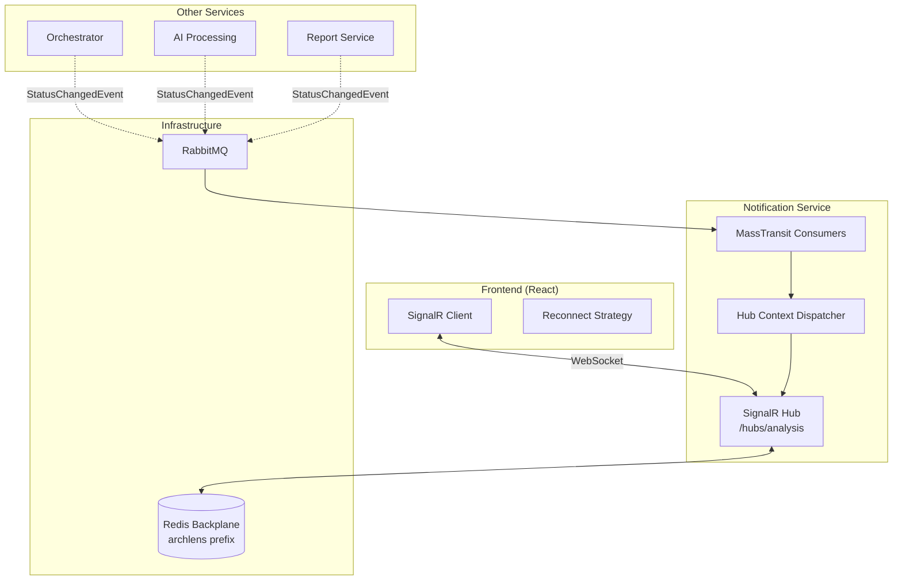
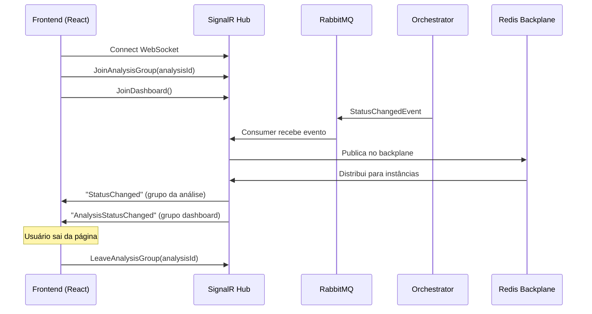
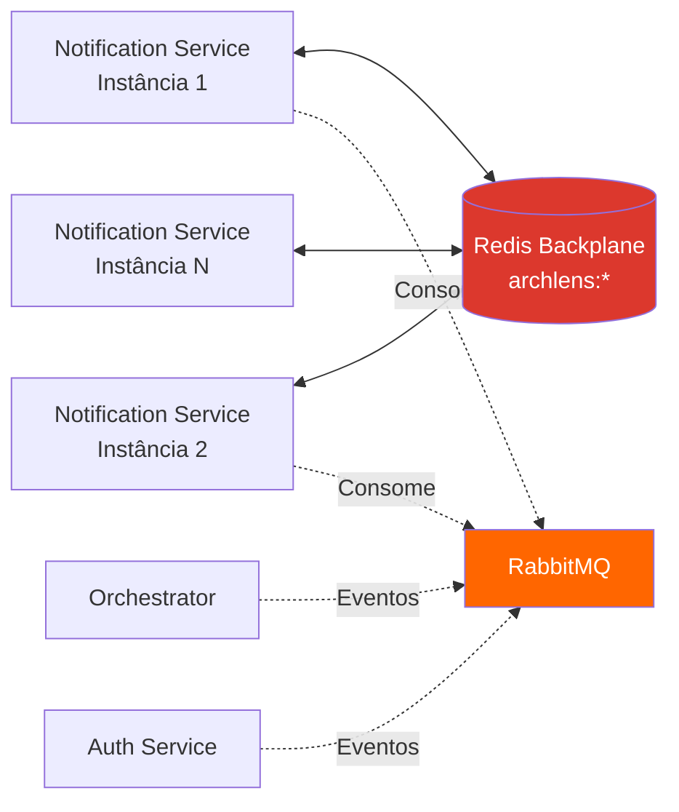
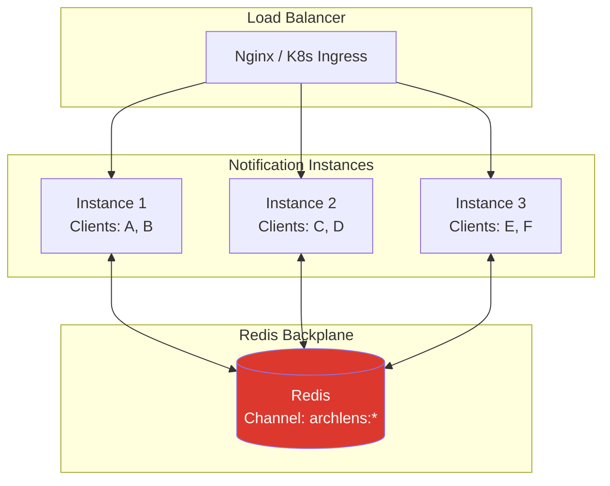
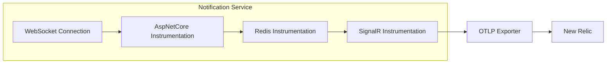

# ArchLens - Notification Service

[](https://github.com/archlens-platform/archlens-notification-service/actions/workflows/ci.yml)
[](https://sonarcloud.io/summary/new_code?id=archlens-platform_archlens-notification-service)
[](https://sonarcloud.io/summary/new_code?id=archlens-platform_archlens-notification-service)
[](https://sonarcloud.io/summary/new_code?id=archlens-platform_archlens-notification-service)
[](https://sonarcloud.io/summary/new_code?id=archlens-platform_archlens-notification-service)
[](https://sonarcloud.io/summary/new_code?id=archlens-platform_archlens-notification-service)
[](https://sonarcloud.io/summary/new_code?id=archlens-platform_archlens-notification-service)
[](https://sonarcloud.io/summary/new_code?id=archlens-platform_archlens-notification-service)

> **Microsserviço de Notificações em Tempo Real via SignalR**
> Hackathon FIAP - Fase 5 | Pós-Tech Software Architecture + IA para Devs
>
> **Autor:** Rafael Henrique Barbosa Pereira (RM366243)

[](https://dotnet.microsoft.com/)
[](https://www.docker.com/)
[](https://learn.microsoft.com/aspnet/core/signalr/)
[](https://redis.io/)
[](https://www.rabbitmq.com/)

## 📋 Descrição

O **Notification Service** é o microsserviço responsável por notificações em **tempo real** para o frontend. Utiliza **SignalR Hub** com **Redis backplane** para suportar escalabilidade horizontal, recebendo eventos de mudança de status via RabbitMQ e propagando-os instantaneamente para os clientes WebSocket conectados. Suporta grupos por análise individual e um grupo de dashboard para visão geral.

## 🏗️ Arquitetura

O projeto utiliza **SignalR** com **Redis backplane** para comunicação em tempo real:



## 🔄 Fluxo de Notificações em Tempo Real



## 🛠️ Tecnologias

| Tecnologia | Versão | Descrição |
|------------|--------|-----------|
| .NET | 9.0 | Framework principal |
| ASP.NET Core SignalR | 9.0 | Hub de comunicação real-time |
| StackExchange.Redis | 2.x | Client Redis / Backplane |
| Redis | 7+ | Backplane para SignalR (scaling horizontal) |
| MassTransit | 8.x | Abstração de Message Broker |
| RabbitMQ | 3.x | Message Broker |
| Serilog | 4.x | Logging estruturado |
| OpenTelemetry | 1.x | Traces e métricas distribuídas |

## 🔒 Isolamento de Banco de Dados

> ⚠️ **Requisito:** "Nenhum serviço pode acessar diretamente o banco de outro serviço."

O Notification Service **não possui banco de dados próprio** — é um serviço stateless que apenas roteia eventos para clientes conectados. O Redis é utilizado exclusivamente como **backplane do SignalR** para sincronizar mensagens entre múltiplas instâncias:



**Eventos consumidos:** `StatusChangedEvent`, `UserAccountDeletedEvent`
**Redis backplane channel prefix:** `archlens`

## 📁 Estrutura do Projeto

```
archlens-notification-service/
├── src/
│   ├── ArchLens.Notification.Api/           # API Layer
│   │   ├── Hubs/                            # SignalR Hub
│   │   │   └── AnalysisHub.cs               # Hub principal
│   │   └── Program.cs                       # Entry point + SignalR config
│   │
│   ├── ArchLens.Notification.Application/   # Application Layer
│   │   ├── Consumers/                       # MassTransit consumers
│   │   │   ├── StatusChangedConsumer.cs     # Mudanças de status
│   │   │   └── UserDeletedConsumer.cs       # Limpeza de conexões
│   │   └── Services/                        # Hub dispatch logic
│   │
│   ├── ArchLens.Notification.Domain/        # Domain Layer
│   │   ├── Events/                          # Event contracts
│   │   └── Interfaces/                      # Contratos
│   │
│   └── ArchLens.Notification.Infrastructure/ # Infrastructure Layer
│       ├── Redis/                           # Backplane configuration
│       └── Messaging/                       # RabbitMQ consumers
│
└── tests/
    └── ArchLens.Notification.Tests/         # Testes unitários e integração
```

## 🚀 Como Executar

### Opção 1: Docker Compose (Recomendado) ✨

Clone o repositório [archlens-docs](https://github.com/archlens-platform/archlens-docs) e execute:

```bash
docker-compose up -d
```

### Opção 2: Manual

#### Pré-requisitos
- .NET 9.0 SDK
- Docker (para Redis e RabbitMQ)

#### Passos

```bash
# 1. Subir infraestrutura
docker-compose -f docker-compose.infra.yml up -d

# 2. Executar a API
dotnet run --project src/ArchLens.Notification.Api
```

A API estará disponível em: `http://localhost:5150`
O Hub SignalR estará disponível em: `ws://localhost:5150/hubs/analysis`

## 📡 SignalR Hub

### Hub Path: `/hubs/analysis`

### Métodos do Cliente → Servidor

| Método | Parâmetro | Descrição |
|--------|-----------|-----------|
| `JoinAnalysisGroup` | `analysisId` (string) | Inscreve o cliente no grupo de uma análise específica |
| `LeaveAnalysisGroup` | `analysisId` (string) | Remove o cliente do grupo de uma análise |
| `JoinDashboard` | — | Inscreve o cliente no grupo do dashboard geral |

### Eventos Servidor → Cliente (Push)

| Evento | Grupo Alvo | Payload | Descrição |
|--------|-----------|---------|-----------|
| `StatusChanged` | Analysis Group | `{ analysisId, status, progress, message }` | Mudança de status de uma análise específica |
| `AnalysisStatusChanged` | Dashboard Group | `{ analysisId, status, title, updatedAt }` | Atualização para o dashboard geral |

## 📊 Escalabilidade Horizontal - Redis Backplane



Quando um evento chega na **Instância 1**, o Redis backplane garante que **todas as instâncias** entreguem a mensagem aos clientes conectados que pertencem ao grupo alvo, independente de qual instância os atende.

## 🔄 Frontend - Estratégia de Reconexão

O frontend utiliza uma estratégia de reconexão progressiva com backoff:

| Tentativa | Delay (ms) | Descrição |
|-----------|------------|-----------|
| 1ª | 0 | Reconexão imediata |
| 2ª | 2.000 | 2 segundos |
| 3ª | 5.000 | 5 segundos |
| 4ª | 10.000 | 10 segundos |
| 5ª+ | 30.000 | 30 segundos (máximo) |

```javascript
// Configuração no frontend React
const connection = new HubConnectionBuilder()
  .withUrl("/hubs/analysis")
  .withAutomaticReconnect([0, 2000, 5000, 10000, 30000])
  .build();
```

## 📨 Eventos

### Eventos Consumidos

| Evento | Ação |
|--------|------|
| `StatusChangedEvent` | Propaga status para grupo da análise e dashboard |
| `UserAccountDeletedEvent` | Encerra conexões do usuário removido |

## 🧪 Testes

```bash
# Rodar todos os testes
dotnet test

# Rodar com cobertura
dotnet test --collect:"XPlat Code Coverage" --settings coverlet.runsettings

# Testes de integração (requer Docker)
dotnet test --filter "Category=Integration"
```

## 🔧 Configuração

### Variáveis de Ambiente

| Variável | Descrição |
|----------|-----------|
| `ConnectionStrings__Redis` | String de conexão Redis (backplane) |
| `RabbitMQ__Host` | Host do RabbitMQ |
| `RabbitMQ__Username` | Usuário do RabbitMQ |
| `RabbitMQ__Password` | Senha do RabbitMQ |
| `SignalR__BackplanePrefix` | Prefixo do canal Redis (`archlens`) |
| `NEW_RELIC_LICENSE_KEY` | Chave de licença do New Relic |

## 🐳 Docker

```bash
docker build -t archlens-notification-service .
docker run -p 5150:8080 archlens-notification-service
```

## 📈 Health Checks

```
GET /health          # Health check geral
GET /health/ready    # Readiness (Redis + RabbitMQ)
GET /health/live     # Liveness
```

## 📊 Observabilidade

O serviço possui integração completa com **OpenTelemetry** e **Serilog** para observabilidade:

### OpenTelemetry (Traces + Metrics)



**Instrumentações:**
- `AspNetCore` - Traces de requisições HTTP e WebSocket
- `StackExchangeRedis` - Traces de operações do backplane
- `HttpClient` - Traces de chamadas externas

**Métricas:**
- Runtime (.NET metrics)
- Process (CPU, Memory)
- Conexões ativas do SignalR
- Mensagens enviadas por grupo

### Serilog (Logs Estruturados)

```json
{
  "Timestamp": "2026-03-15T00:00:00Z",
  "Level": "Information",
  "MessageTemplate": "StatusChanged pushed to group {AnalysisId} with status {Status}",
  "Properties": {
    "AnalysisId": "guid-123",
    "Status": "Completed",
    "ConnectedClients": 3,
    "CorrelationId": "abc-123",
    "ServiceName": "notification-service"
  }
}
```

---

FIAP - Pós-Tech Software Architecture + IA para Devs | Fase 5 - Hackathon (12SOAT + 6IADT)
